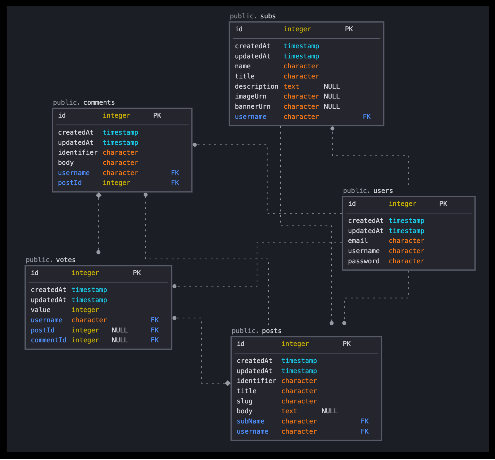
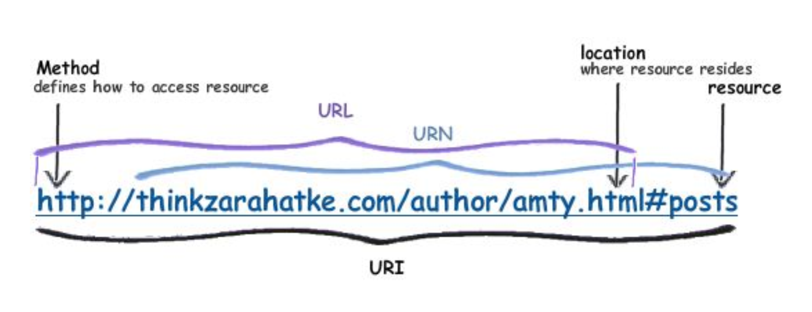

### **[ Entity 생성하기 ]**

- Entity생성이유  
   TypeORM을 사용하게 되면, Entity로 선언할경우 자동으로 테이블로 변환되기 때문에,  
   클래스를 생성한 후 그 안에 컬럼들을 정의하면된다.

- ERD
  

- subs : 커뮤니티
- post : 커뮤니티 내 포스트
- votes : 추천/비추천 투표 (게시글, 댓글)
- comments : 댓글

1. 폴더 및 파일 생성

   - `server/src/entities` 하위에 엔티티.ts생성
     ```
         - User.ts
         - Sub.ts
         - Post.ts
         - Comments.ts
         - Vote.ts
     ```

2. 엔티티 생성 시 필요한 모듈 설치

   - `bcryptjs` : 암호화 모듈 - 비밀번호 암호화 하여 데이터베이스에 저장하도록
   - `class-validator` : object의 property 검증 라이브러리 - 클라이언트 요청 데이터 유효성 검증
   - `class-transformer` : json 객체를 클랙스의 인스턴스로 변환(반대도 가능)

   ```bash
    # server 경로에서 설치
    npm install bcryptjs class-validator class-transformer --save
    npm install @types/bcryptjs --save-dev
   ```

### **[ Base Entity 생성 ]**

- 모든 Entity에 공통적으로 들어가는 속성들을 정의한 뒤, 다른 엔티티에서 상속받아 사용한다.
- 예시 : id, createDate, updateDate ...

- `@PrimaryGeneratedColumn()` : (데코레이터 클래스) 기본키(PK)임을 표시하는데 사용

- `server/src/entites` 하위에 `Entity.ts` 생성 후 `BaseEntity`를 상속한 뒤, 공통 속성 정의

  - `BaseEntity` : typeORM에서 제공하는 orm기능들을 사용할 수 있게함.

    ```typescript
    import { BaseEntity, CreateDateColumn, PrimaryGeneratedColumn, UpdateDateColumn } from 'typeorm';

    export default abstract class Enity extends BaseEntity {
      @PrimaryGeneratedColumn()
      id: number;

      @CreateDateColumn()
      createdAt: Date;

      @UpdateDateColumn()
      updateAt: Date;
    }
    ```

### **[ User Entity 생성 ]**

- 데코레이터 클래스

  - `@Entity()` : 클래스가 Entity임을 나타내는 데 사용
  - `@Column()` : 컬럼을 나타내는데 사용
  - `@Index()` : 데이터베이스 인덱스를 생성. 속성 또는 엔티티에 사용될 수 있으며, 엔티티에 선언할 경우 복합열로 인덱스 생성 가능
  - `@IsEmail([option],[errmsg])` : 이메일 유효성 검사
  - `@Length([min],[max],[errmsg])` : 길이 유효성 검사

* User.ts 작성

  ```typescript
  import { IsEmail, Length } from 'class-validator';
  import { Entity, PrimaryGeneratedColumn, Column, Index, OneToMany, BeforeInsert } from 'typeorm';
  import bcrypt from 'bcryptjs';

  @Entity('users') // 엔티티이름 users
  export class User {
    @Index()
    @IsEmail(undefined, { message: '이메일 주소가 잘못되었습니다.' })
    @Length(1, 255, { message: '이메일 주소는 비워 둘 수 없습니다.' })
    @Column({ unique: true })
    email: string;

    @Index()
    @Length(3, 32, { message: '사용자 이름은 3자 이상이어야 합니다.' })
    @Column()
    username: string;

    @Length(6, 255, { message: '비밀번호는 6자리 이상이어야 합니다.' })
    @Column()
    password: string;

    // @OneToMany([타입], this.객체 => 연결된곳.객체 , option)
    @OneToMany(() => Post, (post) => post.user)
    posts: Post[];

    @OneToMany(() => Vote, (vote) => vote.user)
    votes: Votes[];

    @BeforeInsert()
    async hashPassword() {
      this.password = await bcrypt.hash(this.password, 6);
    }
  }
  ```

### **[ Sub Entity 생성 ]**

- `@JoinColumn()`
  - 어떤 관계쪽에 외래키(Foreign Key)를 가지고 있는지 나타냄 (연관관계의 주인 !)
  - `name` : 외래키 속성명. 디폴트는 : propertyName + referencedColumnName
  - `referencedColumnName` : 참조 엔티티 속성명. 디폴트는 id
  - 둘다 없으면 FK 필드는 [FK속성명+id]

* Sub.ts 파일 작성

  ```typescript
  import { Expose } from 'class-transformer';
  import { BaseEntity, Column, Entity, Index, JoinColumn, ManyToOne, OneToMany } from 'typeorm';
  import { PlainObjectToNewEntityTransformer } from 'typeorm/query-builder/transformer/PlainObjectToNewEntityTransformer';
  import { User } from './User';

  @Entity('subs')
  // export defult : 다른파일에서 가져다 쓸 수 있도록!
  export default class Sub extends BaseEntity {
    @Index()
    @Column({ unique: true })
    name: string;

    @Column()
    title: string;

    @Column({ type: 'text', nullable: true })
    description: string;

    @Column({ nullable: true })
    imageUrn: string;

    @Column({ nullable: true })
    bannerUrn: string;

    @Column()
    username: string;

    @ManyToOne(() => User)
    @JoinColumn({ name: 'username', referencedColumnName: 'username' })
    user: User;

    @OneToMany(() => PlainObjectToNewEntityTransformer, (post) => post.sub)
    posts: Post[];

    @Expose()
    get imageUrl(): string {
      return this.imageUrn ? `${process.env.APP_URL}/images/${this.imageUrn}` : 'https://www.gravatar.com/avatar?d=omp&f=y';
    }

    @Expose()
    get bannerUrl(): string {
      return this.bannerUrl ? `${process.env.APP_URL}/images/${this.bannerUrl}` : undefined;
    }
  }
  ```

### **[ Class-transformer ]**

```text
 **Class-transformer** :
 Plane Object => 클래스 인스턴스로 변환 가능, 반대도 가능
```

- Javascript에는 크게 두가지 object 형태가 있음

  - plain object
    ```JSON
        // intances of Oject Class
        {
            "id":1,
            "name":"Ann",
            "age":24
        }
    ```
  - class objecgt

    ```js
    // instances of classes
    class User {
      id;
      name;
      age;

      getName() {
        return this.name;
      }
    }
    ```

- 데이터 처리 시 차이  
   [ 예시 firstName + lastName ]
  - Class-transformer 사용 안할경우
    ```javascript
    fetch('users.json').then((users: User[]) => {
      return users.map((u) => toFullName(u));
    });
    function toFullName(user) {
      return `${user.firstName} ${user.lastName}`;
    }
    ```
  - Class-transformer 사용
    ```javascript
    fetch('users.json').then((users: User[]) => {
      const realUsers = plainToInstance(User, users);
      return realUsers.map((u) => u.getName());
    });
    function toFullName(user) {
      return `${user.firstName} ${user.lastName}`;
    }
    ```
- 사용 시 장점 : 상태와 행위가 함께 있는 응집력있는 코드가 됨

- 이 프로젝트에서 이용하는 방법
  - 엔티티 생성 시 상태 뿐 아니라, 행위까지 엔티티 안에 정의하여, 프론트엔드에서 사용 할 수 있게 해준다
- class-transformer에서 제공하는 데코레이터
  - `@Expose` : 해당 getter/method 반환 결과를 객체 리턴 시 함께 리턴해줌
  - `@Exclude` : 해당 프로퍼티 변환 스킵

### **[ URI / URL / URN ]**

- URI (Identifier) : 자원의 식별자

  - URL (Locator) : 자원의 위치로 식별
  - URN (Name) : 자원의 고유한 이름으로 식별

- URL과 URN의 차이
  ```
      URL : 어떻게 리소스를 얻을 것이고, 어디에서 가져와야 하는지 명시하는 URI
      URN : 경로와 리소스 자체를 특정하는 것을 목표로하는 URL (리소스를 어떻게 접근할 것인지 명시x)
  ```
  

### **[ Post Entity 생성 ]**

- Post.ts 파일 작성

```ts
import { Exclude, Expose } from 'class-transformer';
import { BeforeInsert, Column, Entity, Index, JoinColumn, ManyToOne, OneToMany } from 'typeorm';
import { makeId, slugfiy } from '../utils/helpers';
import { Comment } from './Comment';
import BaseEntity from './Entity';
import Sub from './Sub';
import { User } from './User';
import Votes from './Vote';

@Entity('posts')
export default class Post extends BaseEntity {
  @Index()
  @Column()
  indentifier: string;

  @Column()
  title: string;

  @Index()
  @Column()
  // slug : 핵심키워드 집합체
  slug: string;

  @Column({ nullable: true, type: 'text' })
  body: string;

  @Column()
  subName: string;

  @Column()
  username: string;

  @ManyToOne(() => User, (user) => user.posts)
  @JoinColumn({ name: 'username', referencedColumnName: 'username' })
  user: User;

  @ManyToOne(() => Sub, (sub) => sub.posts)
  @JoinColumn({ name: 'subName', referencedColumnName: 'name' })
  sub: Sub;

  @Exclude()
  @OneToMany(() => Comment, (comment) => comment.post)
  comments: Comment[];

  @Exclude()
  @OneToMany(() => Votes, (vote) => vote.post)
  votes: Votes[];

  @Expose() get url(): string {
    // r로시작하는건 레딧에서 하는걸 따라한거라 의미없음
    return `/r/${this.subName}/${this.indentifier}/${this.slug}`;
  }

  @Expose() get commentCount(): number {
    return this.comments?.length;
  }
  @Expose() get voteScore(): number {
    return this.votes?.reduce((memo, curt) => memo + (curt.value || 0), 0);
  }

  protected userVote: number;

  setUserVote(user: User) {
    const index = this.votes?.findIndex((v) => v.username === user.username);
    this.userVote = index > -1 ? this.votes[index].value : 0;
  }

  @BeforeInsert()
  makeIdAndSlug() {
    this.indentifier = makeId(7);
    this.slug = slugfiy(this.title);
  }

  //
}
```

### **[ Vote Entity 생성 ]**

- Vote.ts 파일 작성

```ts
import { Column, Entity, JoinColumn, ManyToOne } from 'typeorm';
import { Comment } from './Comment';
import BaseEntity from './Entity';
import Post from './Post';
import { User } from './User';

@Entity('votes')
export default class Votes extends BaseEntity {
  @Column()
  value: number;

  @ManyToOne(() => User)
  @JoinColumn({ name: 'username', referencedColumnName: 'username' })
  user: User;

  @Column()
  username: string;

  @Column({ nullable: true })
  postId: number;

  @ManyToOne(() => Post)
  post: Post;

  @Column({ nullable: true })
  commentId: number;

  @ManyToOne(() => Comment)
  comment: Comment;
}
```

### **[ Comment Entity 생성 ]**

- Comment.ts 파일 작성

```typescript
import { Exclude, Expose } from 'class-transformer';
import { BeforeInsert, Column, Entity, Index, JoinColumn, ManyToOne, OneToMany } from 'typeorm';
import { makeId } from '../utils/helpers';
import BaseEntity from './Entity';
import Post from './Post';
import { User } from './User';
import Votes from './Vote';

@Entity('comments')
export class Comment extends BaseEntity {
  @Index()
  @Column()
  identifier: string;

  @Column()
  body: string;

  @Column()
  username: string;

  @ManyToOne(() => User)
  @JoinColumn({ name: 'username', referencedColumnName: 'username' })
  user: User;

  @Column()
  postId: number;

  @ManyToOne(() => Post, (post) => post.comments, { nullable: false })
  post: Post;

  @Exclude()
  @OneToMany(() => Votes, (Vote) => Vote.comment)
  votes: Votes[];

  protected userVote: number;

  setUserVote(user: User) {
    // 해당 댓글에대한 사용자의 vote value 가져옴
    const index = this.votes?.findIndex((v) => v.username === user.username);
    this.userVote = index > -1 ? this.votes[index].value : 0;
  }

  @Expose() get voteScore(): number {
    const initialValue = 0;
    return this.votes?.reduce((previousValue, currentObject) => previousValue + (currentObject.value || 0), initialValue);
  }

  @BeforeInsert()
  makeId() {
    this.identifier = makeId(8);
  }
}
```
