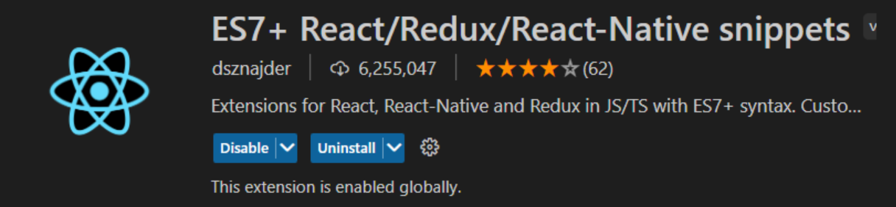
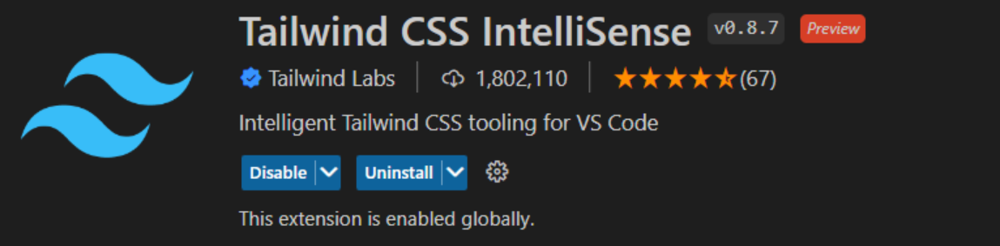

### **[ Nextjs 앱에 Tailwind CSS 적용하기 ]**

- client 디렉토리 하위로 이동 후 필요한 모듈 설치

  ```bash
     cd client
     # -D : 개발환경을 위한 모듈 설정(dev Dependency 설정)
     npm i -D postcss-preset-env tailwindcss
  ```

- client/package.json > devDependencies 에 추가된걸 확인할 수 있음!

- Tailwind Css를 사용하기 위해 필요한 설정파일 생성 -> tailwind.config.js

  ```bash
     npx tailwind init
  ```

- PostCSS 빌드 적용을 위한 postcss 설정파일 생성 -> postcss.config.js

  ```bash
     touch postcss.config.js
  ```

  - 해당 파일에 위에 설치한 모듈들 사용하도록 작성

  ```ts
  module.exports = {
    plugins: ['tailwindcss', 'postcss-preset-env'],
  };
  ```

  ```
  PostCSS란?
  POST CSS는 우리의 CSS를 조금 더 현대적으로 바꿔주는 플러그인입니다.
  좀 더 풀어 설명하자면 POST CSS는 JS 플러그인을 사용하여 CSS를 변환시키는 툴입니다.
  POST CSS는 언어가 아니라 자동으로 현대적인 CSS를 호환 가능하도록 변환시켜주는 플러그인일 뿐이다.
  POST CSS는 CSS에 문제가 없는지 미리 확인해서 에러 로그를 준다.
  PostCSS 자체는 아무 일도 하지 않습니다. 다만 다양한 플러그인과, 플러그인을 추가할 수 있는 환경을 제공할 뿐입니다.
  ```

  - TailWind를 사용할 수 있는 세팅이 끝났다면, tailwind를 Css파일로 넣어줘야하는데,
    최상단(globals.css)파일에 넣어주면됨

  ```
  @tailwind base;
  @tailwind components;
  @tailwind utilities;
  ```

* client 폴더 하위에 src폴더를 생성하고, 어플리케이션에서 중점적으로 작성되는 파일들을 이동시킴 : pages, styles 폴더
* CSS적용할 경로설정

```ts
// postcss.config.js
/** @type {import('tailwindcss').Config} */
module.exports = {
  content: ['./src/pages/**/*.tsx'],
  theme: {
    extend: {},
  },
  plugins: [],
};
```

### **[ 회원가입 페이지 UI 생성하기 ]**

- pages 폴더 하위에 `register.tsx` 파일 생성
- vs extention에 `snippets` 설치하면, `rafce`로 리액트 함수컴포넌트 템플릿 자동완성
  
- tailwind css 자동완성 익스텐션  
  
- className을 값에따라 편하게 변경할 수 있는 모듈 설치

```bash
  npm install classnames --save
```

### **[ 회원가입 페이지 기능 생성하기 ]**

- 필요모듈 설치
  jsonwebtoken : jwt 토큰생성
  dotenv : env파일의 환경변수를 사용하기위한것! (프론트는 이미 다른모듈에 포함되어서 설치된듯?)
  cookie : 쿠키사용

```bash
   npm install jsonwebtoken dotenv cookie --save

   # dev dependence 추가
   npm i --save-dev @types/jsonwebtoken @types/cookie
```
